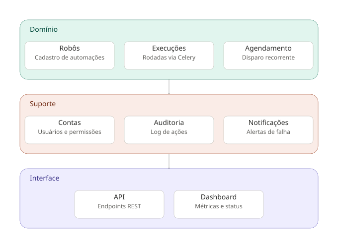
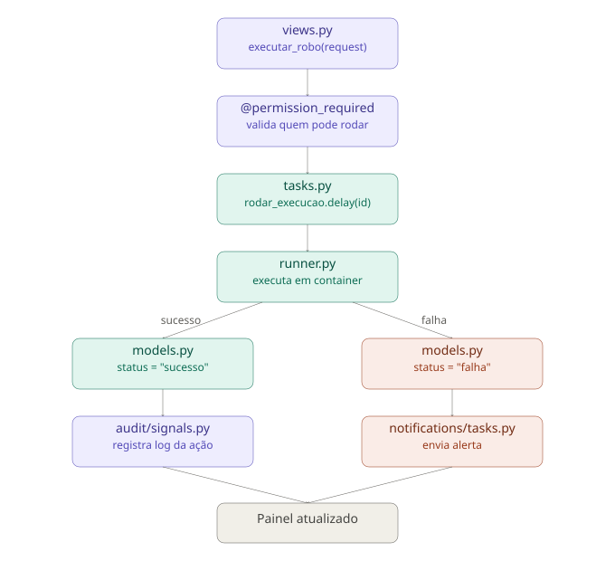

# Maestro

> Orquestrador de automações RPA construído em Django, do zero ao nível sênior — com segurança tratada como requisito desde a primeira linha de código, não como algo adicionado depois.

**Status atual:** 🟡 Em desenvolvimento — Nível 1 (Iniciante)

---

## Sobre este projeto

Este é um **projeto de estudos**, construído como parte de uma trilha pessoal de aprendizado (lógica de programação → Python intermediário/avançado → RPA → async → mensageria → Django/FastAPI → MongoDB, PostegreSQL, Docker). O Maestro é o projeto integrador dessa trilha.

Apesar de ser um ambiente de estudos, ele é documentado e versionado com o mesmo rigor de um projeto profissional, cada decisão relevante, cada correção de bug e cada etapa concluída fica registrada aqui.

## O que é o Maestro

Um sistema web para cadastrar, executar, agendar e monitorar automações RPA (robôs). Pense nele como um painel de controle central: em vez de cada script RPA rodar solto na sua máquina, o Maestro dá visibilidade, controle de acesso, agendamento e histórico de execução pra esses robôs.

## Diagramas de arquitetura



Os apps se organizam em três camadas: **Domínio** (`robots`, `executions`, `scheduler`), **Suporte** (`accounts`, `audit`, `notifications`) e **Interface** (`api`, `dashboard`). A interface consome o domínio, e o domínio se apoia no suporte para segurança e rastreabilidade.



Caminho do código do clique em "rodar robô" até o log salvo: view valida permissão → task Celery assíncrona → execução isolada em container → status gravado → auditoria (sempre) e notificação (em caso de falha).

---

## Stack técnica

| Camada                 | Tecnologia                       | Status                                        |
| ---------------------- | -------------------------------- | --------------------------------------------- |
| Backend                | Django 6.1                       | ✅ Em uso                                     |
| Gerenciador de pacotes | `uv`                             | ✅ Em uso                                     |
| Banco de dados         | SQLite (dev)                     | ✅ Em uso — PostgreSQL planejado pra produção |
| Frontend               | Django Templates + HTML/CSS puro | ✅ Em uso                                     |
| Execução assíncrona    | Celery + Redis                   | ⏳ Planejado (Nível 2)                        |
| API                    | Django REST Framework            | ⏳ Planejado (Nível 2)                        |
| Isolamento de execução | Docker (containers efêmeros)     | ⏳ Planejado (Nível 3)                        |

**Decisão registrada:** o frontend usa Django Templates puro (HTML/CSS, sem framework JS) por opção deliberada nesta fase de aprendizado, fundamentos primeiro. Uma migração futura para React + API (DRF) está cogitada para quando o projeto atingir o Nível 2, quando o Django passaria a atuar como backend puro.

## Identidade visual

O padrão visual do projeto segue uma estética de **terminal/console**, pensada para remeter ao público técnico (devs, analistas de RPA):

- Cards com titlebar de três bolinhas (estilo macOS/VSCode)
- Fonte monoespaçada: `IBM Plex Mono`
- Fundo azul petróleo (`#17212f`) com gradiente radial sutil — nunca preto puro
- Cor de destaque única: azul royal (`#0114c1e9`)
- Sem gradientes ciano/roxo genéricos de "SaaS de IA"

## Observações

> O front-end foi desenvolvido com auxílio de IA para agilizar o processo, pois não é o foco principal deste projeto.

---

## Estrutura de apps

| App             | Camada    | Responsabilidade                   | Status                 |
| --------------- | --------- | ---------------------------------- | ---------------------- |
| `accounts`      | Suporte   | Autenticação, usuários, permissões | 🟡 Em andamento        |
| `robots`        | Domínio   | Cadastro de robôs/automações       | 🟡 Em andamento        |
| `executions`    | Domínio   | Execuções, histórico, logs         | ⏳ Não iniciado        |
| `scheduler`     | Domínio   | Agendamento recorrente             | ⏳ Planejado (Nível 2) |
| `audit`         | Suporte   | Auditoria/log de ações             | ⏳ Planejado (Nível 3) |
| `notifications` | Suporte   | Alertas de falha                   | ⏳ Planejado (Nível 3) |
| `api`           | Interface | Endpoints REST                     | ⏳ Planejado (Nível 2) |
| `dashboard`     | Interface | Métricas e visão consolidada       | ⏳ Planejado (Nível 4) |

---

## Checklist de progresso

### Nível 1 — Iniciante

**Setup do projeto**

- [x] Ambiente virtual isolado (`uv`)
- [x] Secrets fora do código (`.env` + `python-dotenv`)
- [x] `SECRET_KEY` via variável de ambiente
- [ ] `DEBUG` lido corretamente do `.env` como booleano (pendente — bug conhecido, ver seção Débito Técnico)
- [x] `.env.example` documentando as variáveis esperadas
- [x] `.gitignore` cobrindo `.env`, `__pycache__`, `db.sqlite3`

**Apps e estrutura**

- [x] App `accounts` criado
- [x] App `robots` criado
- [x] App `executions` criado
- [x] Apps registrados em `INSTALLED_APPS`

**Autenticação (`accounts`)**

- [x] Migrations aplicadas com o `User` padrão do Django
- [x] Superusuário criado
- [x] Tela de login funcional (`LoginView` do Django)
- [x] `LOGIN_URL`, `LOGIN_REDIRECT_URL`, `LOGOUT_REDIRECT_URL` configurados
- [x] Logout via POST (não GET), protegido por CSRF
- [ ] Registrar validação: acesso negado a rotas protegidas quando deslogado (teste manual)

**Frontend base**

- [x] Pasta `templates/` configurada em `TEMPLATES.DIRS`
- [x] Pasta `static/` configurada em `STATICFILES_DIRS`
- [x] `base.css` com variáveis de tema e componentes reutilizáveis
- [x] `base.html` com header e área de conteúdo (``)
- [x] Tela de login com identidade visual própria (`login.css`)
- [x] Tela `home` de teste, herdando de `base.html`

**App `robots` — front com dados fake**

- [x] `templates/robots/list.html` criado, estendendo `base.html`
- [x] Tabela de robôs com status operacional (ativo/inativo/manutenção)
- [x] Coluna de status da última execução (sucesso/falha/rodando)
- [x] View `robot_list` + rota `/robots/` funcionando (dados fake, sem model ainda)

**App `robots` — back (a fazer)**

- [ ] Model `Robo` definido (nome, descrição, status, dono/usuário responsável)
- [ ] Migrations geradas e aplicadas
- [ ] Registrado no Django Admin
- [ ] View conectada ao banco (substituir dados fake)
- [ ] `forms.py` com validação de entrada
- [ ] Permissões (`@login_required` / `@permission_required`) aplicadas

**App `executions` — back (a fazer)**

- [ ] Model `Execucao` definido (robô, status, início, fim, log)
- [ ] Relação `ForeignKey` com `Robo`
- [ ] Migrations geradas e aplicadas
- [ ] Registrado no Django Admin

**Testes (a fazer)**

- [ ] Testes unitários dos models (`robots`, `executions`)
- [ ] Testes das views (acesso logado/deslogado, permissões)
- [ ] Teste manual do fluxo completo (criar → listar → editar → excluir)

### Nível 2 — Intermediário (não iniciado)

- [ ] Groups e Permissions do Django configurados
- [ ] Celery + Redis integrados
- [ ] Execução isolada via `subprocess` (lista de argumentos, nunca `shell=True`)
- [ ] `django-celery-beat` para agendamento recorrente
- [ ] Rate limiting no login (`django-axes` ou similar)
- [ ] Log de auditoria básico
- [ ] API REST inicial (DRF) com autenticação por token/JWT

### Nível 3 — Avançado (não iniciado)

- [ ] Execução em containers Docker efêmeros
- [ ] Gestão de segredos real (cofre/criptografia em repouso)
- [ ] Headers de segurança (`SECURE_HSTS_SECONDS`, `SESSION_COOKIE_SECURE`, etc.)
- [ ] `django-csp` configurado
- [ ] Scan de dependências (`pip-audit`/`safety`) no fluxo de trabalho
- [ ] Observabilidade (logging estruturado, alertas)

### Nível 4 — Sênior (não iniciado)

- [ ] Threat modeling formal (STRIDE)
- [ ] Revisão LGPD (retenção de logs, criptografia ponta a ponta)
- [ ] CI/CD com testes, lint e scan de segurança
- [ ] Infra como código (Terraform)
- [ ] Plano de disaster recovery testado

---

## Débito técnico conhecido

Registrado aqui de propósito, parte de documentar como projeto real é admitir o que ainda não está certo.

| Item                | Descrição                                                                                                                                                                                   | Prioridade               |
| ------------------- | ------------------------------------------------------------------------------------------------------------------------------------------------------------------------------------------- | ------------------------ |
| `DEBUG` no settings | `os.getenv('DEBUG')` retorna string, não booleano — `DEBUG` fica sempre `True` na prática, mesmo com `DEBUG=False` no `.env`                                                                | 🔴 Alta (segurança)      |
| `EMAIL_BACKEND`     | Setting `MAILERS` no `settings.py` não existe no Django; precisa virar `EMAIL_BACKEND` (string)                                                                                             | 🟡 Média                 |
| Formatter do editor | VSCode formatando `.html` como HTML genérico, quebrando tags Django (``) — mitigado parcialmente com `.vscode/settings.json`, mas vale revisar extensão adequada para templates Django | 🟢 Baixa (já contornado) |

---

## Convenções do projeto

- **Commits**: mensagens em português, descrevendo o quê e o porquê, não só o quê
- **Templates**: uma tag Django por linha (nunca condensar `` em uma linha só — já causou bugs de parsing por formatação automática)
- **CSS**: variáveis de tema centralizadas em `base.css`; cada tela específica tem seu próprio arquivo CSS enxuto, só com o que é exclusivo dela
- **Segurança**: nenhuma feature é considerada "pronta" sem revisão de segurança básica (permissões, CSRF, validação de entrada)

---

## Como rodar localmente

```bash
# Instalar dependências
uv sync

# Rodar migrations
uv run manage.py migrate

# Criar superusuário (se ainda não tiver um)
uv run manage.py createsuperuser

# Subir o servidor
uv run manage.py runserver
```

Acesse `http://localhost:8000/login/` para entrar.

---

## Por que este projeto existe

Documentar isso aqui também: o Maestro não é só "mais um CRUD". A ideia é que, ao final da trilha de estudos, esse projeto sirva como peça central de portfólio — mostrando não apenas que o código funciona, mas que cada decisão (de arquitetura, de segurança, de UX) foi pensada e justificada. É por isso que este README é tão detalhado: ele é, em si, uma evidência do processo.

**Vitor Zavan** · _Estudos contínuos em Python, Automação e Engenharia de Software_
