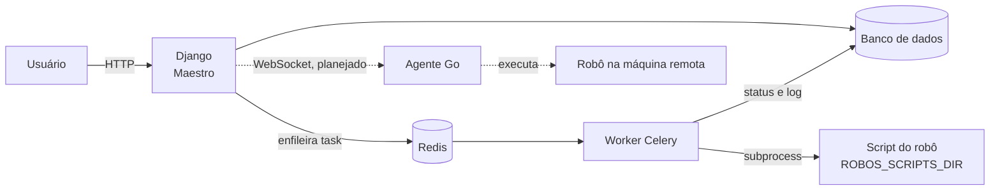

# Maestro

Orquestrador de automações RPA construído em Django. Centraliza o cadastro, a execução e o histórico de robôs de automação, com controle de acesso por perfil e registro completo de cada execução.

Primeiro produto da **ZV Labs**.

> **Sobre o projeto:** o Maestro é desenvolvido como projeto de estudo, dentro de uma trilha de aprendizado em Python, RPA e desenvolvimento web. Apesar disso, é documentado, testado e versionado como um projeto real, e este README descreve o sistema e o seu andamento, não o conteúdo de estudo.

**Status:** em desenvolvimento. Execução de robôs funcionando localmente via Celery; próxima fase é a execução remota por um agente em Go.

---

## Sumário

- [Funcionalidades](#funcionalidades)
- [Arquitetura](#arquitetura)
- [Stack](#stack)
- [Estrutura do projeto](#estrutura-do-projeto)
- [Como rodar localmente](#como-rodar-localmente)
- [Rotas](#rotas)
- [Perfis e permissões](#perfis-e-permissões)
- [Execução de robôs](#execução-de-robôs)
- [Modelo de dados](#modelo-de-dados)
- [Testes](#testes)
- [Segurança](#segurança)
- [Andamento](#andamento)
- [Débito técnico](#débito-técnico)
- [Convenções](#convenções)

---

## Funcionalidades

**Disponível hoje**

- Página pública da ZV Labs (portfólio) com acesso ao Maestro
- Login e logout com o sistema de autenticação do Django
- Painel com a distribuição dos robôs por status, atividade dos últimos 14 dias e console com as execuções recentes
- Cadastro, edição e exclusão de robôs, com validação via `ModelForm`
- Execução real de robôs em segundo plano (Celery + Redis), com captura do log
- Histórico global de execuções e tela de detalhe com o log numerado e linhas de erro destacadas
- Atualização automática da tela de detalhe enquanto a execução está em andamento
- Controle de acesso por grupos (Operador e Administrador RPA)
- Mensagens de confirmação e de erro em todas as ações

**Planejado**

- Agente em Go para executar robôs em outras máquinas, conectado ao Maestro por WebSocket
- Parada real de execuções em andamento
- Agendamento recorrente
- API REST

---

## Arquitetura



Hoje, quando um robô é iniciado, o Django cria uma `Execucao` com status `pendente` e envia uma task para o Redis. O worker do Celery pega a task, executa o script do robô e grava o status final e o log no banco.

Na próxima fase, a execução passa para um **agente escrito em Go**, instalado na máquina onde os robôs vivem. O agente abre uma conexão WebSocket com o Maestro, recebe os comandos de iniciar e parar, executa o robô no ambiente dele e devolve status e log. O Django continua sendo o ponto central de cadastro, permissões e histórico; o robô continua sendo Python.

---

## Stack

| Camada | Tecnologia | Situação |
|---|---|---|
| Backend | Django 6.1 | Em uso |
| Pacotes e ambiente | uv | Em uso |
| Banco de dados | SQLite | Em uso (PostgreSQL previsto para produção) |
| Frontend | Django Templates, HTML e CSS | Em uso |
| Fila e execução assíncrona | Celery + Redis | Em uso |
| Execução remota | Agente em Go + Django Channels (WebSocket) | Planejado |
| Agendamento | django-celery-beat | Planejado |
| API | Django REST Framework + JWT | Planejado |

---

## Estrutura do projeto

```
maestro-zavan/
├── accounts/            # autenticação e painel
├── robots/              # cadastro de robôs, disparo de execução, task Celery
│   ├── forms.py
│   ├── tasks.py
│   └── views.py
├── executions/          # histórico e detalhe de execuções
├── maestro/             # configurações, URLs e app Celery
│   ├── celery.py
│   ├── settings.py
│   └── urls.py
├── scripts/             # pasta de robôs permitidos (ROBOS_SCRIPTS_DIR)
│   └── robo_exemplo.py
├── static/
│   ├── css/
│   └── img/
├── templates/
│   ├── base.html
│   ├── portfolio/
│   ├── accounts/
│   ├── robots/
│   └── executions/
├── manage.py
└── pyproject.toml
```

---

## Como rodar localmente

### Pré-requisitos

- Python 3.14
- [uv](https://docs.astral.sh/uv/)
- Redis

No Ubuntu:

```bash
sudo apt install redis-server
sudo systemctl enable --now redis-server
redis-cli ping   # deve responder PONG
```

### Instalação

```bash
git clone <url-do-repositorio>
cd maestro-zavan
uv sync
```

Crie um arquivo `.env` na raiz:

```
SECRET_KEY=gere-uma-chave-nova
DEBUG=True
ALLOWED_HOSTS=localhost,127.0.0.1
CELERY_BROKER_URL=redis://localhost:6379/0
ROBOS_SCRIPTS_DIR=/caminho/absoluto/para/scripts
```

`ROBOS_SCRIPTS_DIR` é opcional. Sem ele, o Maestro usa a pasta `scripts/` do projeto.

Prepare o banco:

```bash
uv run manage.py migrate
uv run manage.py createsuperuser
```

Crie os grupos de acesso (uma vez só):

```bash
uv run manage.py shell
```

```python
from django.contrib.auth.models import Group, Permission

Group.objects.get_or_create(name="Operador")
admin_rpa, _ = Group.objects.get_or_create(name="Administrador RPA")
admin_rpa.permissions.set(Permission.objects.filter(content_type__app_label="robots"))
```

### Execução

São dois processos, cada um em um terminal:

```bash
uv run manage.py runserver
```

```bash
uv run celery -A maestro worker --loglevel=info
```

Acesse `http://localhost:8000/`.

---

## Rotas

| Rota | Acesso | Descrição |
|---|---|---|
| `/` | Público | Página da ZV Labs |
| `/login/` | Público | Login |
| `/logout/` | Autenticado (POST) | Logout |
| `/painel/` | Autenticado | Painel do Maestro |
| `/robots/` | Autenticado | Lista de robôs |
| `/robots/novo/` | `robots.add_robo` | Cadastro de robô |
| `/robots/<id>/editar/` | `robots.change_robo` | Edição de robô |
| `/robots/<id>/excluir/` | `robots.delete_robo` | Exclusão com confirmação |
| `/robots/<id>/iniciar/` | Autenticado (POST) | Dispara uma execução |
| `/robots/<id>/parar/` | Autenticado (POST) | Encerra a execução em andamento |
| `/execucoes/` | Autenticado | Histórico de execuções |
| `/execucoes/<id>/` | Autenticado | Detalhe e log de uma execução |
| `/admin/` | Superusuário | Admin do Django |

---

## Perfis e permissões

| Perfil | Pode |
|---|---|
| Operador | Ver robôs e execuções, iniciar e parar execuções |
| Administrador RPA | Tudo do Operador, mais cadastrar, editar e excluir robôs |

As permissões são verificadas nas views com `@permission_required(..., raise_exception=True)`: um usuário autenticado sem permissão recebe **403**, e não um redirecionamento para o login. Os botões correspondentes também são ocultados na interface, mas a proteção real é a da view.

Superusuários ignoram as verificações de permissão. Para testar os perfis, use um usuário comum associado a um dos grupos.

---

## Execução de robôs

### Ciclo de vida

```
pendente  →  rodando  →  sucesso
                      ↘  falha
```

1. **pendente**: a execução foi criada e a task enviada para a fila
2. **rodando**: o worker iniciou o script e registrou `iniciado_em`
3. **sucesso** ou **falha**: o processo terminou; o Maestro grava `finalizado_em`, o status e o log

Regras aplicadas no disparo:

- Só robôs com status **ativo** podem ser iniciados
- Um robô não pode ter duas execuções em andamento (`pendente` ou `rodando`) ao mesmo tempo
- A task só é enviada depois que a execução é gravada no banco (`transaction.on_commit`)

### Onde ficam os scripts

O campo `caminho_script` de um robô é **relativo** à pasta definida em `ROBOS_SCRIPTS_DIR`. Exemplos válidos: `robo_exemplo.py`, `coleta_notas/main.py`.

Caminhos absolutos ou que tentem sair dessa pasta (como `../outro/script.py`) são recusados e a execução termina como falha. Essa pasta funciona como a lista de scripts aprovados: o cadastro de um robô só aponta para um script dentro dela, nunca decide livremente o que executar.

### Logs

Tudo que o script escreve na saída padrão e na saída de erro é salvo no campo `log` da execução. Robôs que usam o módulo `logging` do Python têm os registros capturados automaticamente. Linhas contendo `ERROR` ou `Traceback` aparecem destacadas na tela de detalhe.

### Limites

| Limite | Valor |
|---|---|
| Tempo máximo de execução | 300 segundos |
| Tamanho do log armazenado | últimos 10.000 caracteres |

### Limitação atual

Os scripts rodam com o Python do ambiente do Maestro. Robôs que dependem de bibliotecas não instaladas nesse ambiente vão falhar. Essa limitação deixa de existir com o agente em Go, que executa cada robô no ambiente da máquina onde ele está instalado.

---

## Modelo de dados

### Robo

| Campo | Tipo | Observação |
|---|---|---|
| `nome` | texto | |
| `descricao` | texto | opcional |
| `caminho_script` | texto | relativo a `ROBOS_SCRIPTS_DIR` |
| `status` | escolha | `ativo`, `inativo`, `manutencao` |
| `responsavel` | FK para usuário | `PROTECT` |
| `criado_em` | data e hora | automático |

### Execucao

| Campo | Tipo | Observação |
|---|---|---|
| `robo` | FK para Robo | `PROTECT` |
| `status` | escolha | `pendente`, `rodando`, `sucesso`, `falha` |
| `disparado_por` | FK para usuário | `SET_NULL`, opcional |
| `iniciado_em` | data e hora | preenchido pelo worker |
| `finalizado_em` | data e hora | preenchido pelo worker |
| `log` | texto | saída do script |

### Decisões de integridade

- **Robô com execuções não pode ser excluído** (`PROTECT`). O histórico é preservado; para aposentar um robô, altere o status para `inativo`.
- **Usuário responsável por robôs não pode ser excluído** (`PROTECT`), para não perder a rastreabilidade de quem responde por cada robô.
- **Excluir o usuário que disparou uma execução não apaga a execução** (`SET_NULL`). O registro continua, apenas sem a referência de quem disparou.

---

## Testes

```bash
uv run manage.py test
```

| Classe | Cobre |
|---|---|
| `RoboModelTest` | criação, status padrão, exibição do status, regra `PROTECT` no responsável |
| `RobotViewsTest` | acesso sem login, listagem, edição, exclusão com e sem execuções associadas |
| `ExecucaoModelTest` | criação, status padrão, regras `PROTECT` e `SET_NULL` |
| `ExecutionViewsTest` | acesso sem login, listagem, detalhe com log, 404 para execução inexistente |

Os testes não precisam do Redis nem do worker: o `TestCase` do Django não dispara callbacks de `transaction.on_commit`, então nenhuma task é enviada durante os testes.

---

## Segurança

- Segredos fora do código, lidos do `.env` (que não é versionado)
- CSRF em todos os formulários
- Ações que alteram dados (logout, excluir, iniciar, parar) aceitas apenas via POST
- Validadores de senha padrão do Django ativos
- Permissões verificadas no backend, com resposta 403
- Execução de scripts restrita a uma pasta aprovada, sem `shell=True` e com tempo limite
- Log exibido com escape automático do Django (nunca com `|safe`)
- Links externos com `rel="noopener noreferrer"`

---

## Andamento

O acompanhamento diário é feito no [Trello do projeto](https://trello.com/b/B9qsNVe8/maestro-orquestrador-rpa).

### Concluído

- Estrutura do projeto, autenticação e identidade visual
- Models `Robo` e `Execucao` com testes
- CRUD de robôs com `ModelForm`
- Histórico e detalhe de execuções
- Testes das views
- Grupos e permissões
- Execução real via Celery + Redis
- Painel com distribuição da frota, atividade e console de execuções
- Página pública da ZV Labs

### Próxima fase: agente em Go

1. Model `Agente` (nome, token, último sinal) e associação de cada robô a um agente
2. Django Channels com autenticação do agente por token
3. Agente Go mínimo: conexão e heartbeat, com status online no painel
4. Comando de iniciar: o agente executa o robô e devolve o log
5. Comando de parar: o agente encerra o processo de verdade
6. Agendamento recorrente enviando comandos para o agente

Regras definidas para o agente desde o início: ele conecta no Maestro (nunca o contrário), cada agente tem o seu próprio token, e ele nunca recebe caminhos ou comandos crus, apenas o identificador do robô, resolvido dentro da pasta aprovada da própria máquina.

### Depois

- API REST (DRF + JWT, com limite de requisições)
- Paginação e filtros no histórico de execuções
- Página de detalhe por robô, com taxa de sucesso e duração média
- Observabilidade e auditoria (logging estruturado, histórico de alterações, cabeçalhos de segurança)

---

## Débito técnico

| Item | Descrição | Prioridade |
|---|---|---|
| `DEBUG` | `os.getenv("DEBUG")` retorna texto, e qualquer texto não vazio é verdadeiro; na prática `DEBUG` fica sempre ativo | Alta |
| `EMAIL_BACKEND` | a configuração de e-mail usa uma chave (`MAILERS`) que o Django não reconhece | Média |
| Parar execução | `robot_stop` marca a execução como finalizada, mas o processo continua no worker; será resolvido pelo agente | Média |
| Estilos inline | as barras do painel usam `style` inline, o que vai conflitar com uma política de CSP rígida | Baixa |
| Grupos via shell | os grupos são criados manualmente; o ideal é uma migração de dados | Baixa |

---

## Convenções

- Commits em português, descrevendo o que mudou e o motivo
- Templates com uma tag do Django por linha
- `base.css` concentra variáveis de tema e componentes usados em mais de uma tela; cada tela tem o próprio CSS
- Rotas referenciadas sempre pelo nome (``), nunca pelo caminho escrito à mão
- Nenhuma funcionalidade é considerada pronta sem revisão de permissão, CSRF e validação de entrada

---

Desenvolvido por **Vitor Zavan**, sob a marca **ZV Labs**.

[GitHub](https://github.com/Zavan7) | [LinkedIn](https://www.linkedin.com/in/vitor-zavan-831907297/)