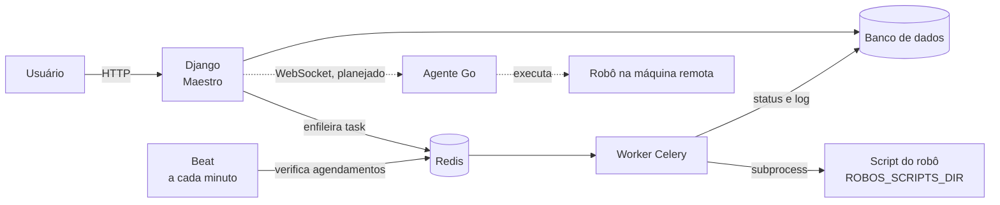

# Maestro

Orquestrador de automações RPA construído em Django. Centraliza o cadastro, a execução, o agendamento e o histórico de robôs de automação, com controle de acesso por perfil e registro completo de cada execução.

Primeiro produto da **ZV Labs**.

> **Sobre o projeto:** o Maestro é desenvolvido como projeto de estudo, dentro de uma trilha de aprendizado em Python, RPA e desenvolvimento web. Apesar disso, é documentado, testado e versionado como um projeto real, e este README descreve o sistema e o seu andamento, não o conteúdo de estudo.

**Versão atual:** 1.0.0, com o agendamento e a aba de configurações já prontos para a próxima versão. Veja o [CHANGELOG](CHANGELOG.md).

---

## Sumário

- [Funcionalidades](#funcionalidades)
- [Arquitetura](#arquitetura)
- [Stack](#stack)
- [Estrutura do projeto](#estrutura-do-projeto)
- [Como rodar localmente](#como-rodar-localmente)
- [Rotas](#rotas)
- [Perfis e permissões](#perfis-e-permissões)
- [Execução de robôs](#execução-de-robôs)
- [Agendamento](#agendamento)
- [Modelo de dados](#modelo-de-dados)
- [Testes](#testes)
- [Segurança](#segurança)
- [Andamento](#andamento)
- [Débito técnico](#débito-técnico)
- [Convenções](#convenções)

---

## Funcionalidades

**Disponível hoje**

- Página pública da ZV Labs (portfólio) com acesso ao Maestro
- Login e logout com o sistema de autenticação do Django
- Painel com a distribuição dos robôs por status, atividade dos últimos 14 dias e console com as execuções recentes
- Cadastro, edição e exclusão de robôs, com validação via `ModelForm`
- Execução real de robôs em segundo plano (Celery + Redis), com captura do log
- Agendamento recorrente por horário e dias da semana, com pausar e retomar
- Estados visuais nas listas: rodando, agendado, pausado e parado, e a próxima execução de cada robô
- Histórico global de execuções, com a origem de cada uma (manual ou agendamento), e tela de detalhe com duração, log numerado e linhas de erro destacadas
- Atualização automática da tela de detalhe enquanto a execução está em andamento
- Controle de acesso por grupos (Operador, Administrador RPA e Administrador do sistema)
- Aba de configurações com gestão de usuários: troca de grupo, desativação e reativação, com registro de todas as alterações
- Mensagens de confirmação e de erro em todas as ações

**Planejado**

- Status do sistema na aba de configurações (Redis, worker e agendador)
- Retenção do histórico com limpeza automática
- Criação de usuários pela aba de configurações
- Limites padrão de execução editáveis (hoje em prévia)
- Agente em Go para executar robôs em outras máquinas, conectado ao Maestro por WebSocket
- Parada real de execuções em andamento
- API REST

---

## Arquitetura


```mermaid
flowchart LR
    U[Usuário] -->|HTTP| D[Django<br/>Maestro]
    D --> DB[(Banco de dados)]
    D -->|enfileira task| R[(Redis)]
    B[Beat<br/>a cada minuto] -->|verifica agendamentos| R
    R --> W[Worker Celery]
    W -->|subprocess| S[Script do robô<br/>ROBOS_SCRIPTS_DIR]
    W -->|status e log| DB
    D -. WebSocket, planejado .-> A[Agente Go]
    A -. executa .-> S2[Robô na máquina remota]
```

Quando um robô é iniciado, pelo botão ou por um agendamento, o disparo passa por uma única função, `disparar_execucao`, que aplica as regras, cria uma `Execucao` com status `pendente` e envia uma task para o Redis. O worker do Celery pega a task, executa o script do robô e grava o status final e o log no banco.

A cada minuto, o beat do Celery envia a tarefa que verifica os agendamentos vencidos e os dispara pelo mesmo caminho.

Na próxima fase, a execução passa para um **agente escrito em Go**, instalado na máquina onde os robôs vivem. O agente abre uma conexão WebSocket com o Maestro, recebe os comandos de iniciar e parar, executa o robô no ambiente dele e devolve status e log. O Django continua sendo o ponto central de cadastro, permissões e histórico; o robô continua sendo Python.

---

## Stack

| Camada | Tecnologia | Situação |
|---|---|---|
| Backend | Django 6.1 | Em uso |
| Pacotes e ambiente | uv | Em uso |
| Banco de dados | SQLite | Em uso (PostgreSQL previsto para produção) |
| Frontend | Django Templates, HTML e CSS | Em uso |
| Fila e execução assíncrona | Celery + Redis | Em uso |
| Agendamento | Celery beat, com uma tarefa própria (sem `django-celery-beat`) | Em uso |
| Execução remota | Agente em Go + Django Channels (WebSocket) | Planejado |
| API | Django REST Framework + JWT | Planejado |

---

## Estrutura do projeto

```
maestro-zavan/
├── accounts/            # autenticação e painel
├── robots/              # cadastro de robôs e disparo de execuções
│   ├── forms.py
│   ├── services.py      # disparar_execucao: o caminho único de disparo
│   ├── tasks.py         # task que executa o robô
│   └── views.py
├── executions/          # histórico e detalhe de execuções
├── scheduler/           # agendamentos e a tarefa que os verifica a cada minuto
│   ├── forms.py
│   ├── models.py
│   ├── tasks.py
│   └── views.py
├── config/              # aba de configurações, permissões e gestão de acesso
│   ├── migrations/      # inclui a migração de dados que cria os grupos
│   ├── models.py
│   ├── services.py      # regras de alteração de acesso
│   └── views.py
├── maestro/             # configurações, URLs e app Celery
│   ├── celery.py
│   ├── settings.py
│   └── urls.py
├── scripts/             # pasta de robôs permitidos (ROBOS_SCRIPTS_DIR)
│   └── robo_exemplo.py
├── static/
│   ├── css/
│   └── img/
├── templates/
│   ├── base.html
│   ├── portfolio/
│   ├── accounts/
│   ├── robots/
│   ├── executions/
│   ├── scheduler/
│   └── config/
├── CHANGELOG.md
├── manage.py
└── pyproject.toml
```

---

## Como rodar localmente

### Pré-requisitos

- Python 3.14
- [uv](https://docs.astral.sh/uv/)
- Redis

No Ubuntu:

```bash
sudo apt install redis-server
sudo systemctl enable --now redis-server
redis-cli ping   # deve responder PONG
```

### Instalação

```bash
git clone <url-do-repositorio>
cd maestro-zavan
uv sync
```

Crie um arquivo `.env` na raiz:

```
SECRET_KEY=gere-uma-chave-nova
DEBUG=True
ALLOWED_HOSTS=localhost,127.0.0.1
CELERY_BROKER_URL=redis://localhost:6379/0
ROBOS_SCRIPTS_DIR=/caminho/absoluto/para/scripts
```

`ROBOS_SCRIPTS_DIR` é opcional. Sem ele, o Maestro usa a pasta `scripts/` do projeto.

Prepare o banco:

```bash
uv run manage.py migrate
uv run manage.py createsuperuser
```

O `migrate` também cria os três grupos de acesso com as permissões certas. Não é preciso nenhum comando manual.

### Execução

São dois processos, cada um em um terminal:

```bash
uv run manage.py runserver
```

```bash
uv run celery -A maestro worker -B --loglevel=info
```

O `-B` roda o agendador (beat) junto com o worker, o que basta em desenvolvimento. Em produção, o beat roda como processo separado e único: `uv run celery -A maestro beat --loglevel=info`.

O worker não recarrega sozinho: depois de alterar models ou tarefas, reinicie-o.

Acesse `http://localhost:8000/`.

---

## Rotas

| Rota | Acesso | Descrição |
|---|---|---|
| `/` | Público | Página da ZV Labs |
| `/login/` | Público | Login |
| `/logout/` | Autenticado (POST) | Logout |
| `/painel/` | Autenticado | Painel do Maestro |
| `/robots/` | Autenticado | Lista de robôs |
| `/robots/novo/` | `robots.add_robo` | Cadastro de robô |
| `/robots/<id>/editar/` | `robots.change_robo` | Edição de robô |
| `/robots/<id>/excluir/` | `robots.delete_robo` | Exclusão com confirmação |
| `/robots/<id>/iniciar/` | `robots.executar_robo` (POST) | Dispara uma execução |
| `/robots/<id>/parar/` | `robots.executar_robo` (POST) | Encerra a execução em andamento |
| `/execucoes/` | Autenticado | Histórico de execuções |
| `/execucoes/<id>/` | Autenticado | Detalhe e log de uma execução |
| `/agendamentos/` | Autenticado | Lista de agendamentos |
| `/agendamentos/novo/` | `scheduler.add_agendamento` | Cadastro de agendamento |
| `/agendamentos/<id>/editar/` | `scheduler.change_agendamento` | Edição de agendamento |
| `/agendamentos/<id>/alternar/` | `scheduler.change_agendamento` (POST) | Pausar ou retomar |
| `/agendamentos/<id>/excluir/` | `scheduler.delete_agendamento` | Exclusão com confirmação |
| `/configuracoes/` | Alguma permissão do app `config` | Aba de configurações |
| `/configuracoes/usuarios/` | `config.gerenciar_usuarios` | Usuários e acesso |
| `/configuracoes/usuarios/<id>/grupo/` | `config.gerenciar_usuarios` (POST) | Troca de grupo |
| `/configuracoes/usuarios/<id>/alternar/` | `config.gerenciar_usuarios` (POST) | Desativar ou reativar |
| `/admin/` | Superusuário | Admin do Django |

---

## Perfis e permissões

| Grupo | Pode |
|---|---|
| Operador | Ver robôs, execuções e agendamentos; iniciar e parar execuções |
| Administrador RPA | Tudo do Operador, mais cadastrar, editar e excluir robôs e agendamentos |
| Administrador do sistema | Iniciar e parar execuções e acessar todas as seções da aba de configurações |

Permissões próprias do projeto, além das que o Django cria para cada model:

| Permissão | Libera |
|---|---|
| `robots.executar_robo` | Iniciar e parar robôs |
| `config.gerenciar_usuarios` | Usuários e acesso |
| `config.ver_status_sistema` | Status do sistema |
| `config.gerenciar_retencao` | Retenção do histórico |
| `config.gerenciar_limites` | Limites padrão de execução (reservada) |

Os grupos são definidos em `config/migrations/0002_grupos_de_acesso.py` e criados pelo `migrate`. As permissões são verificadas nas views: um usuário autenticado sem permissão recebe **403**, e não um redirecionamento para o login. Os botões correspondentes também são ocultados na interface, mas a proteção real é a da view.

Na gestão de usuários, ninguém altera o próprio acesso, e superusuários só podem ser alterados por outro superusuário. Usuários são desativados, nunca excluídos, e cada alteração de acesso fica registrada com autor, alvo e data.

Superusuários ignoram as verificações de permissão. Para testar os perfis, use um usuário comum associado a um dos grupos.

---

## Execução de robôs

### Ciclo de vida

```
pendente  →  rodando  →  sucesso
                      ↘  falha
```

1. **pendente**: a execução foi criada e a task enviada para a fila
2. **rodando**: o worker iniciou o script e registrou `iniciado_em`
3. **sucesso** ou **falha**: o processo terminou; o Maestro grava `finalizado_em`, o status e o log

Regras aplicadas no disparo, em `robots/services.py`, valendo para o botão e para os agendamentos:

- Só robôs com status **ativo** podem ser iniciados
- Um robô não pode ter duas execuções em andamento (`pendente` ou `rodando`) ao mesmo tempo
- A task só é enviada depois que a execução é gravada no banco (`transaction.on_commit`)

### Onde ficam os scripts

O campo `caminho_script` de um robô é **relativo** à pasta definida em `ROBOS_SCRIPTS_DIR`. Exemplos válidos: `robo_exemplo.py`, `coleta_notas/main.py`.

Caminhos absolutos ou que tentem sair dessa pasta (como `../outro/script.py`) são recusados e a execução termina como falha. Essa pasta funciona como a lista de scripts aprovados: o cadastro de um robô só aponta para um script dentro dela, nunca decide livremente o que executar.

### Logs

Tudo que o script escreve na saída padrão e na saída de erro é salvo no campo `log` da execução. Robôs que usam o módulo `logging` do Python têm os registros capturados automaticamente. Linhas contendo `ERROR` ou `Traceback` aparecem destacadas na tela de detalhe.

### Limites

| Limite | Valor |
|---|---|
| Tempo máximo de execução | 300 segundos |
| Tamanho do log armazenado | últimos 10.000 caracteres |

### Limitação atual

Os scripts rodam com o Python do ambiente do Maestro. Robôs que dependem de bibliotecas não instaladas nesse ambiente vão falhar. Essa limitação deixa de existir com o agente em Go, que executa cada robô no ambiente da máquina onde ele está instalado.

---

## Agendamento

Cada agendamento tem um robô, um horário e os dias da semana em que dispara. A cada minuto, o beat envia a tarefa `verificar_agendamentos`, que:

1. Busca os agendamentos ativos com o horário do minuto atual e o dia de hoje marcado, no fuso de São Paulo
2. Reivindica cada um com um `UPDATE` condicional em `ultimo_disparo`, o que garante que nenhum agendamento dispare duas vezes no mesmo minuto
3. Dispara pela mesma função do botão "iniciar", registrando a origem e o agendamento na execução

Recusas (robô em manutenção, execução em andamento) viram um aviso no log do worker, sem interromper os outros agendamentos. Um minuto em que o agendador estava parado não é recuperado depois, de propósito.

---

## Modelo de dados

### Robo

| Campo | Tipo | Observação |
|---|---|---|
| `nome` | texto | |
| `descricao` | texto | opcional |
| `caminho_script` | texto | relativo a `ROBOS_SCRIPTS_DIR` |
| `status` | escolha | `ativo`, `inativo`, `manutencao` |
| `responsavel` | FK para usuário | `PROTECT` |
| `criado_em` | data e hora | automático |

### Execucao

| Campo | Tipo | Observação |
|---|---|---|
| `robo` | FK para Robo | `PROTECT` |
| `status` | escolha | `pendente`, `rodando`, `sucesso`, `falha` |
| `origem` | escolha | `manual`, `agendamento` |
| `agendamento` | FK para Agendamento | `SET_NULL`, opcional |
| `disparado_por` | FK para usuário | `SET_NULL`, vazio em execuções agendadas |
| `iniciado_em` | data e hora | preenchido pelo worker |
| `finalizado_em` | data e hora | preenchido pelo worker |
| `log` | texto | saída do script |

### Agendamento

| Campo | Tipo | Observação |
|---|---|---|
| `robo` | FK para Robo | `CASCADE` |
| `horario` | hora | segundos zerados ao salvar |
| `segunda` a `domingo` | sete campos booleanos | pelo menos um marcado |
| `ativo` | booleano | pausar e retomar |
| `ultimo_disparo` | data e hora | preenchido pela tarefa, trava contra disparo duplo |
| `criado_por` | FK para usuário | `SET_NULL` |

Um robô não pode ter dois agendamentos no mesmo horário (restrição de unicidade no banco).

### ConfiguracaoSistema e RegistroAcesso

`ConfiguracaoSistema` tem um único registro, com a retenção do histórico, e é onde as permissões de configuração são declaradas. `RegistroAcesso` guarda cada alteração de acesso (troca de grupo, desativação, reativação), com autor, alvo e data, e não pode ser editado pela interface.

### Decisões de integridade

- **Robô com execuções não pode ser excluído** (`PROTECT`). O histórico é preservado; para aposentar um robô, altere o status para `inativo`.
- **Usuário responsável por robôs não pode ser excluído** (`PROTECT`), para não perder a rastreabilidade de quem responde por cada robô.
- **Excluir o usuário que disparou uma execução não apaga a execução** (`SET_NULL`).
- **Excluir um agendamento não apaga as execuções que ele disparou** (`SET_NULL`), e excluir um robô sem execuções leva junto os agendamentos dele (`CASCADE`).

---

## Testes

```bash
uv run manage.py test
```

| Classe | Cobre |
|---|---|
| `RoboModelTest` | criação, status padrão, exibição do status, regra `PROTECT` no responsável |
| `RobotViewsTest` | acesso sem login, listagem, edição, exclusão com e sem execuções, robô em manutenção, 403 sem `executar_robo` |
| `DisparoTest` | regras do disparo e envio da tarefa só depois do commit |
| `ExecucaoModelTest` | criação, status padrão, regras `PROTECT` e `SET_NULL` |
| `ExecutionViewsTest` | acesso sem login, listagem, detalhe com log, 404 para execução inexistente |
| `AgendamentoModelTest` | validação dos dias, segundos zerados, próxima ocorrência e seus casos de borda |
| `VerificarAgendamentosTest` | disparo no minuto certo, trava contra disparo duplo, pausados, dias desmarcados e robô em manutenção |
| `ScheduleViewsTest` | acesso, permissões, criação, pausa e exclusão mantendo o histórico |
| `ConfiguracaoSistemaTest` | registro único da configuração |
| `ConfigHomeTest` | acesso à aba, menu e visibilidade de cada seção por permissão |
| `ServicosDeAcessoTest` | troca de grupo, desativação, travas contra alteração do próprio acesso e de superusuários, registro |
| `ConfigUsersViewsTest` | tela de usuários, permissões, recusas como mensagem e ações só por POST |
| `LogoutTest` | logout encerra a sessão e volta para a página inicial |

Os testes não precisam do Redis nem do worker: o `TestCase` do Django não dispara callbacks de `transaction.on_commit`, então nenhuma task é enviada durante os testes. Os testes do agendamento fixam o relógio com `mock.patch`, para não depender da hora em que rodam.

---

## Segurança

- Segredos fora do código, lidos do `.env` (que não é versionado)
- CSRF em todos os formulários
- Ações que alteram dados (logout, excluir, iniciar, parar, pausar, alterar acesso) aceitas apenas via POST
- Validadores de senha padrão do Django ativos
- Permissões verificadas no backend, com resposta 403, incluindo iniciar e parar robôs
- Nenhum caminho pela interface altera `is_superuser`; ninguém altera o próprio acesso
- Alterações de acesso registradas e não editáveis
- Execução de scripts restrita a uma pasta aprovada, sem `shell=True` e com tempo limite
- Log exibido com escape automático do Django (nunca com `|safe`)
- Links externos com `rel="noopener noreferrer"`

---

## Andamento

O acompanhamento diário é feito no [Trello do projeto](https://trello.com/b/B9qsNVe8/maestro-orquestrador-rpa).

### Versão 1.0 (lançada)

Cadastro de robôs, execução em segundo plano, histórico com log, permissões e painel. Detalhes no [CHANGELOG](CHANGELOG.md).

### Pronto para a próxima versão

- Agendamento recorrente, com estados visuais e origem das execuções
- Aba de configurações com gestão de usuários e registro de alterações
- Permissão própria para iniciar e parar robôs, e grupos criados por migração

### Em andamento: aba de configurações

- Status do sistema (Redis, worker e agendador)
- Retenção do histórico, com a limpeza automática pelo beat
- Criação de usuários pela tela

### Versão 1.1: robustez e tempo real

- Tempo limite e número de tentativas configuráveis por robô
- Botão "parar" que encerra o processo de verdade
- Log ao vivo na tela de detalhe, com Django Channels
- Alertas na tela quando um robô falha, estoura o tempo ou atrasa
- Limites padrão de execução editáveis

### Depois

- Clientes e ambientes (servidor da ZV Labs, instalações do cliente ou os dois)
- Agente em Go para executar robôs em outras máquinas
- API REST (DRF + JWT, com limite de requisições)

---

## Débito técnico

| Item | Descrição | Prioridade |
|---|---|---|
| Parar execução | `robot_stop` marca a execução como finalizada, mas o processo continua no worker; será resolvido pelo executor da 1.1 e pelo agente | Média |
| Retenção sem limpeza | o valor de retenção já é guardado, mas a tarefa que apaga o histórico antigo ainda não existe | Média |
| Criação de usuários | ainda feita pelo admin do Django | Baixa |
| Estilos inline | as barras do painel usam `style` inline, o que vai conflitar com uma política de CSP rígida | Baixa |

---

## Convenções

- Commits em português, descrevendo o que mudou e o motivo
- Templates com uma tag do Django por linha
- `base.css` concentra variáveis de tema e componentes usados em mais de uma tela; cada tela tem o próprio CSS
- Rotas referenciadas sempre pelo nome (``), nunca pelo caminho escrito à mão
- Regras de negócio usadas por mais de um lugar moram em funções de serviço, sem conhecimento de HTTP
- Nenhuma funcionalidade é considerada pronta sem revisão de permissão, CSRF e validação de entrada

---

Desenvolvido por **Vitor Zavan**, sob a marca **ZV Labs**.

[GitHub](https://github.com/Zavan7) | [LinkedIn](https://www.linkedin.com/in/vitor-zavan-831907297/)